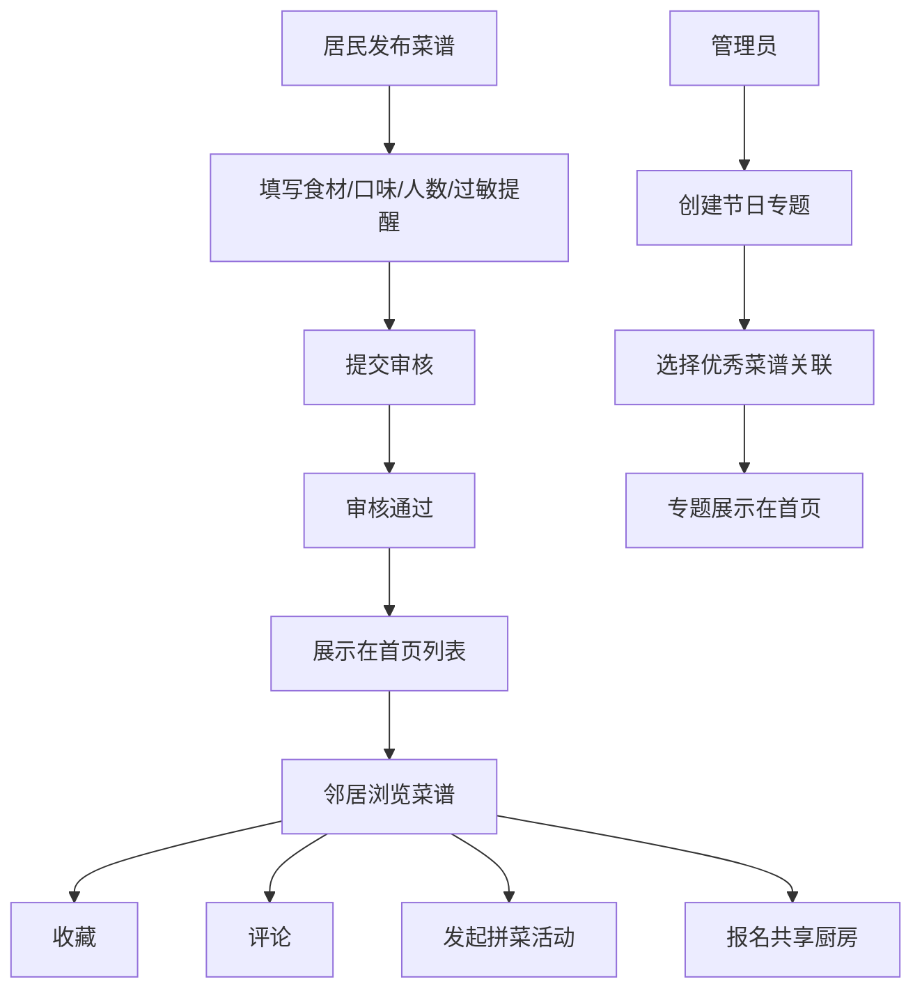

## 1. 产品概述

社区菜谱交换站是一个面向邻里社区的美食分享与互动平台，解决居民间美食交流不畅、闲置食材浪费、邻里关系疏远的问题。目标用户为社区居民，提供菜谱发布、收藏评论、拼菜活动、线下共享厨房等功能。

- 通过美食分享增进邻里关系，打造有温度的社区生活
- 减少食材浪费，提倡资源共享与环保生活理念

## 2. 核心功能

### 2.1 用户角色

| 角色 | 注册方式 | 核心权限 |
|------|----------|----------|
| 普通居民 | 手机号/账号注册 | 发布菜谱、收藏评论、发起/参与拼菜、报名共享厨房 |
| 管理员 | 后台账号登录 | 整理节日专题、管理内容审核、数据统计 |

### 2.2 功能模块

1. **首页**：菜谱瀑布流、热门推荐、节日专题、活动预告
2. **菜谱发布页**：食材清单、口味标签、适合人数、过敏提醒、步骤说明
3. **菜谱详情页**：完整信息展示、收藏按钮、评论区、发起拼菜入口、共享厨房报名
4. **拼菜活动页**：活动列表、活动详情、参与报名、食材分摊
5. **共享厨房页**：线下活动列表、关联菜谱、场地时间、报名管理
6. **个人中心**：我的菜谱、我的收藏、我的活动、个人信息
7. **管理后台**：专题管理、内容审核、活动统计、用户管理

### 2.3 页面详情

| 页面名称 | 模块名称 | 功能描述 |
|----------|----------|----------|
| 首页 | Hero区域 | 社区主题标语、搜索框、快捷入口图标 |
| 首页 | 菜谱瀑布流 | 多列卡片布局展示菜谱，支持筛选分类 |
| 首页 | 节日专题区 | 管理员整理的专题合集，卡片式展示 |
| 菜谱发布页 | 基础信息表单 | 菜名、封面图、菜系分类、口味标签 |
| 菜谱发布页 | 食材清单 | 动态增删食材项，支持分量单位选择 |
| 菜谱发布页 | 过敏提醒 | 常见过敏原勾选 + 自定义填写 |
| 菜谱详情页 | 菜谱内容区 | 食材、步骤、营养信息的结构化展示 |
| 菜谱详情页 | 互动区 | 收藏按钮、评论列表、发表评论 |
| 菜谱详情页 | 活动入口 | 发起拼菜按钮、关联的共享厨房活动 |
| 拼菜活动页 | 活动列表 | 卡片展示进行中的拼菜活动，显示参与人数 |
| 拼菜活动页 | 活动详情 | 参与人员、食材分摊清单、集合时间地点 |
| 共享厨房页 | 活动日历 | 按月展示线下共享厨房活动安排 |
| 共享厨房页 | 活动详情 | 关联菜谱、场地信息、报名人员列表 |
| 管理后台 | 专题管理 | 创建节日专题、选择关联菜谱、编辑专题介绍 |
| 管理后台 | 内容审核 | 审核菜谱和评论，支持移除违规内容 |

## 3. 核心流程

### 3.1 发布菜谱流程
居民进入发布页 → 填写菜谱基础信息 → 录入食材清单 → 设置口味和适合人数 → 勾选过敏提醒 → 上传步骤说明 → 提交发布 → 自动进入审核

### 3.2 参与拼菜流程
浏览菜谱/活动列表 → 查看拼菜活动详情 → 点击参与报名 → 确认食材分摊 → 加入活动群聊 → 线下参与活动

### 3.3 管理员整理专题流程
进入管理后台 → 创建新专题 → 填写专题名称和节日介绍 → 搜索筛选优秀菜谱 → 添加到专题（仅关联，不修改原文）→ 发布专题到首页

## 4. 用户界面设计

### 4.1 设计风格
- **主色调**：温暖橙红色 (#E67E22) - 代表美食与热情
- **辅助色**：米黄色 (#FDF6E3)、苔绿色 (#52BE80) - 健康自然的感觉
- **中性色**：暖白色 (#FFFEF9)、深棕色 (#3E2723) - 温馨的阅读体验
- **按钮风格**：圆润胶囊形，悬停有轻微上浮和阴影加深效果
- **字体**：展示字体 - "Lora"（衬线，优雅有温度），正文字体 - "Noto Sans SC"（清晰易读）
- **布局风格**：卡片式布局，柔和圆角，轻微阴影，营造温馨纸质感
- **图标风格**：手绘风线条图标，搭配食物相关emoji增加趣味性
- **背景纹理**： subtle 噪点纹理 + 食物图案底纹（低透明度）

### 4.2 页面设计概述

| 页面名称 | 模块名称 | UI元素 |
|----------|----------|--------|
| 首页 | Hero区域 | 大标题"邻里厨房·美味共享"，渐变色背景，搜索框带放大镜图标 |
| 首页 | 菜谱卡片 | 圆角卡片，封面图 + 菜名标签 + 收藏数 + 作者头像，hover时轻微放大 |
| 首页 | 专题卡片 | 更大尺寸，带有节日主题装饰边框，显示"专题"标识徽章 |
| 菜谱详情页 | 内容区 | 顶部大图，食材清单用标签样式，步骤带编号卡片 |
| 菜谱详情页 | 过敏提醒 | 红色边框警示卡片，带有感叹号图标 |
| 拼菜活动页 | 活动卡片 | 显示进度条（参与人数/目标人数），状态标签（招募中/已满员） |
| 管理后台 | 专题编辑 | 左侧菜谱选择列表，右侧已选菜谱，拖拽排序，原文预览但不可编辑 |

### 4.3 响应式
- **桌面优先**设计，在 1280px 以上宽度展示最佳效果
- 断点设计：1024px（平板横向）、768px（平板纵向）、480px（手机）
- 移动端：菜谱瀑布流改为单列，底部导航栏替代顶部菜单，触摸区域放大至48px

### 4.4 动效设计
- 页面加载：内容区域渐入 + 卡片依次淡入（staggered 100ms间隔）
- 菜谱卡片：hover时 translateY(-4px) + 阴影加深 + 图片轻微缩放
- 收藏按钮：点击时心形图标填充动画 + 弹跳效果
- 表单提交：按钮旋转加载动画 + 成功时勾选扩散效果
- 滚动：导航栏随滚动变化透明度，专题区视差滚动效果
