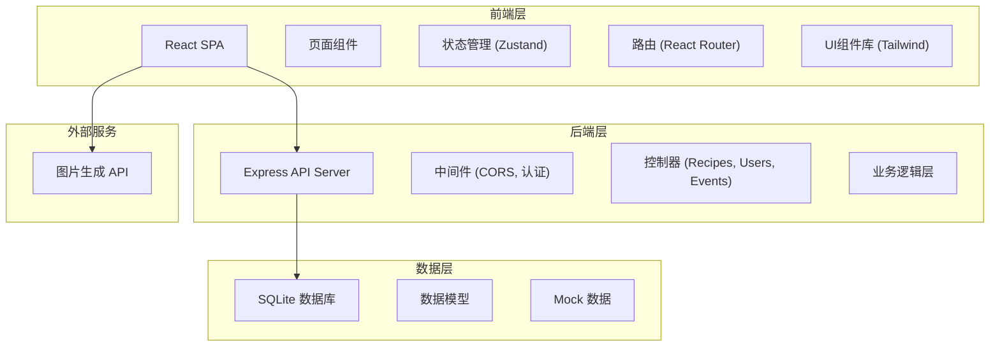
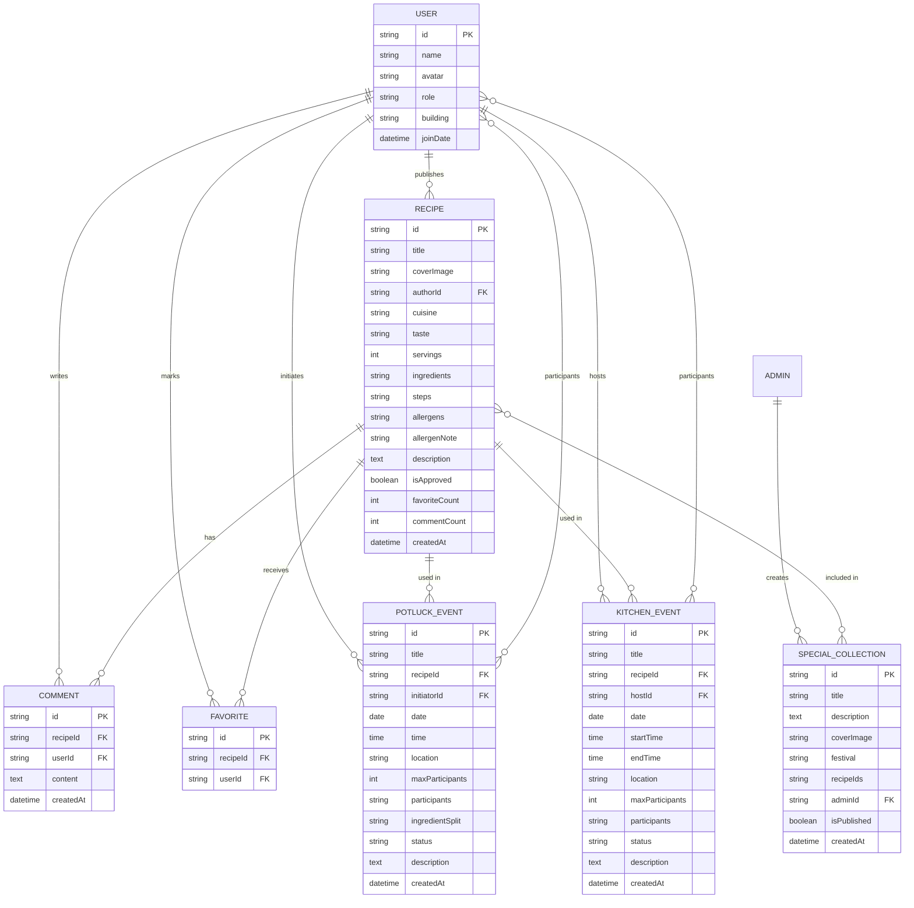

## 1. 架构设计



## 2. 技术描述

- **前端**：React@18 + TypeScript + tailwindcss@3 + vite
- **初始化工具**：vite-init
- **后端**：Express@4 + TypeScript
- **数据库**：SQLite（开发环境）+ Mock 数据
- **状态管理**：Zustand
- **路由**：react-router-dom@6
- **图标库**：lucide-react
- **图片服务**：trae-api 图片生成接口

## 3. 路由定义

| 路由 | 页面 | 用途 |
|------|------|------|
| `/` | 首页 | 菜谱瀑布流、节日专题、活动入口 |
| `/recipe/:id` | 菜谱详情页 | 查看菜谱、收藏、评论、发起拼菜 |
| `/publish` | 菜谱发布页 | 发布新菜谱 |
| `/potluck` | 拼菜活动列表 | 浏览和参与拼菜活动 |
| `/potluck/:id` | 拼菜活动详情 | 活动详情、报名参与 |
| `/kitchen` | 共享厨房 | 线下活动日历、活动列表 |
| `/kitchen/:id` | 共享厨房详情 | 活动详情、关联菜谱、报名 |
| `/profile` | 个人中心 | 我的菜谱、收藏、活动 |
| `/admin` | 管理后台 | 专题管理、内容审核 |
| `/admin/special` | 专题编辑 | 创建/编辑节日专题 |

## 4. API 定义

### 4.1 TypeScript 类型定义

```typescript
// 用户类型
interface User {
  id: string;
  name: string;
  avatar: string;
  role: 'resident' | 'admin';
  building: string;
  joinDate: string;
}

// 食材项
interface Ingredient {
  name: string;
  quantity: number;
  unit: string;
}

// 菜谱类型
interface Recipe {
  id: string;
  title: string;
  coverImage: string;
  authorId: string;
  author: User;
  cuisine: string;
  taste: string[];
  servings: number;
  ingredients: Ingredient[];
  steps: string[];
  allergens: string[];
  allergenNote?: string;
  description: string;
  isApproved: boolean;
  favoriteCount: number;
  commentCount: number;
  createdAt: string;
}

// 评论类型
interface Comment {
  id: string;
  recipeId: string;
  userId: string;
  user: User;
  content: string;
  createdAt: string;
}

// 收藏类型
interface Favorite {
  id: string;
  recipeId: string;
  userId: string;
}

// 拼菜活动
interface PotluckEvent {
  id: string;
  title: string;
  recipeId: string;
  recipe: Recipe;
  initiatorId: string;
  initiator: User;
  date: string;
  time: string;
  location: string;
  maxParticipants: number;
  participants: { userId: string; user: User; contribution?: string }[];
  ingredientSplit: { userId: string; ingredients: Ingredient[] }[];
  status: 'recruiting' | 'full' | 'completed' | 'cancelled';
  description: string;
  createdAt: string;
}

// 共享厨房活动
interface KitchenEvent {
  id: string;
  title: string;
  recipeId: string;
  recipe: Recipe;
  hostId: string;
  host: User;
  date: string;
  startTime: string;
  endTime: string;
  location: string;
  maxParticipants: number;
  participants: { userId: string; user: User }[];
  status: 'upcoming' | 'ongoing' | 'completed' | 'cancelled';
  description: string;
  createdAt: string;
}

// 节日专题
interface SpecialCollection {
  id: string;
  title: string;
  description: string;
  coverImage: string;
  festival: string;
  recipeIds: string[];
  recipes: Recipe[];
  adminId: string;
  isPublished: boolean;
  createdAt: string;
}
```

### 4.2 API 端点

| 方法 | 路径 | 描述 | 参数 | 返回 |
|------|------|------|------|------|
| GET | `/api/recipes` | 获取菜谱列表 | `page`, `pageSize`, `cuisine`, `taste` | `{ list: Recipe[], total: number }` |
| GET | `/api/recipes/:id` | 获取菜谱详情 | `id` | `Recipe` |
| POST | `/api/recipes` | 发布菜谱 | `Recipe` (without id) | `Recipe` |
| GET | `/api/recipes/:id/comments` | 获取菜谱评论 | `id` | `Comment[]` |
| POST | `/api/recipes/:id/comments` | 发表评论 | `content`, `userId` | `Comment` |
| POST | `/api/recipes/:id/favorite` | 收藏/取消收藏 | `userId` | `{ favoriteCount: number, isFavorited: boolean }` |
| GET | `/api/potlucks` | 获取拼菜活动列表 | `status` | `PotluckEvent[]` |
| GET | `/api/potlucks/:id` | 获取拼菜活动详情 | `id` | `PotluckEvent` |
| POST | `/api/potlucks` | 发起拼菜活动 | `PotluckEvent` (without id) | `PotluckEvent` |
| POST | `/api/potlucks/:id/join` | 参与拼菜活动 | `userId`, `contribution?` | `PotluckEvent` |
| GET | `/api/kitchens` | 获取共享厨房列表 | `date` | `KitchenEvent[]` |
| GET | `/api/kitchens/:id` | 获取共享厨房详情 | `id` | `KitchenEvent` |
| POST | `/api/kitchens` | 创建共享厨房活动 | `KitchenEvent` (without id) | `KitchenEvent` |
| POST | `/api/kitchens/:id/register` | 报名共享厨房 | `userId` | `KitchenEvent` |
| GET | `/api/specials` | 获取节日专题列表 | | `SpecialCollection[]` |
| GET | `/api/specials/:id` | 获取专题详情 | `id` | `SpecialCollection` |
| POST | `/api/specials` | 创建专题 | `SpecialCollection` (without id) | `SpecialCollection` |
| PUT | `/api/specials/:id` | 更新专题 | `title`, `description`, `recipeIds` | `SpecialCollection` |
| GET | `/api/user/:id/favorites` | 获取用户收藏 | `id` | `Recipe[]` |
| GET | `/api/user/:id/recipes` | 获取用户发布的菜谱 | `id` | `Recipe[]` |
| GET | `/api/admin/recipes/pending` | 获取待审核菜谱 | | `Recipe[]` |
| PUT | `/api/admin/recipes/:id/approve` | 审核通过菜谱 | | `Recipe` |
| DELETE | `/api/admin/recipes/:id` | 删除菜谱 | | `{ success: boolean }` |
| DELETE | `/api/admin/comments/:id` | 删除评论 | | `{ success: boolean }` |

## 5. 数据模型

### 6.1 ER 图



### 6.2 数据库 DDL

```sql
-- 用户表
CREATE TABLE users (
  id TEXT PRIMARY KEY,
  name TEXT NOT NULL,
  avatar TEXT,
  role TEXT NOT NULL DEFAULT 'resident',
  building TEXT,
  join_date DATETIME DEFAULT CURRENT_TIMESTAMP
);

-- 菜谱表
CREATE TABLE recipes (
  id TEXT PRIMARY KEY,
  title TEXT NOT NULL,
  cover_image TEXT,
  author_id TEXT NOT NULL REFERENCES users(id),
  cuisine TEXT,
  taste TEXT,
  servings INTEGER NOT NULL,
  ingredients TEXT NOT NULL,
  steps TEXT NOT NULL,
  allergens TEXT,
  allergen_note TEXT,
  description TEXT,
  is_approved BOOLEAN DEFAULT 0,
  favorite_count INTEGER DEFAULT 0,
  comment_count INTEGER DEFAULT 0,
  created_at DATETIME DEFAULT CURRENT_TIMESTAMP
);

-- 评论表
CREATE TABLE comments (
  id TEXT PRIMARY KEY,
  recipe_id TEXT NOT NULL REFERENCES recipes(id) ON DELETE CASCADE,
  user_id TEXT NOT NULL REFERENCES users(id),
  content TEXT NOT NULL,
  created_at DATETIME DEFAULT CURRENT_TIMESTAMP
);

-- 收藏表
CREATE TABLE favorites (
  id TEXT PRIMARY KEY,
  recipe_id TEXT NOT NULL REFERENCES recipes(id) ON DELETE CASCADE,
  user_id TEXT NOT NULL REFERENCES users(id),
  UNIQUE(recipe_id, user_id)
);

-- 拼菜活动表
CREATE TABLE potluck_events (
  id TEXT PRIMARY KEY,
  title TEXT NOT NULL,
  recipe_id TEXT NOT NULL REFERENCES recipes(id),
  initiator_id TEXT NOT NULL REFERENCES users(id),
  event_date DATE NOT NULL,
  event_time TIME NOT NULL,
  location TEXT NOT NULL,
  max_participants INTEGER NOT NULL,
  participants TEXT,
  ingredient_split TEXT,
  status TEXT NOT NULL DEFAULT 'recruiting',
  description TEXT,
  created_at DATETIME DEFAULT CURRENT_TIMESTAMP
);

-- 共享厨房活动表
CREATE TABLE kitchen_events (
  id TEXT PRIMARY KEY,
  title TEXT NOT NULL,
  recipe_id TEXT NOT NULL REFERENCES recipes(id),
  host_id TEXT NOT NULL REFERENCES users(id),
  event_date DATE NOT NULL,
  start_time TIME NOT NULL,
  end_time TIME NOT NULL,
  location TEXT NOT NULL,
  max_participants INTEGER NOT NULL,
  participants TEXT,
  status TEXT NOT NULL DEFAULT 'upcoming',
  description TEXT,
  created_at DATETIME DEFAULT CURRENT_TIMESTAMP
);

-- 节日专题表
CREATE TABLE special_collections (
  id TEXT PRIMARY KEY,
  title TEXT NOT NULL,
  description TEXT,
  cover_image TEXT,
  festival TEXT,
  recipe_ids TEXT NOT NULL,
  admin_id TEXT NOT NULL REFERENCES users(id),
  is_published BOOLEAN DEFAULT 0,
  created_at DATETIME DEFAULT CURRENT_TIMESTAMP
);

-- 索引
CREATE INDEX idx_recipes_author ON recipes(author_id);
CREATE INDEX idx_recipes_cuisine ON recipes(cuisine);
CREATE INDEX idx_recipes_approved ON recipes(is_approved);
CREATE INDEX idx_comments_recipe ON comments(recipe_id);
CREATE INDEX idx_potlucks_status ON potluck_events(status);
CREATE INDEX idx_kitchens_date ON kitchen_events(event_date);
CREATE INDEX idx_specials_published ON special_collections(is_published);
```

### 6.3 初始 Mock 数据

```sql
-- 初始用户
INSERT INTO users (id, name, avatar, role, building) VALUES 
('u1', '张阿姨', 'https://api.dicebear.com/7.x/avataaars/svg?seed=zhang', 'resident', '3号楼'),
('u2', '李叔', 'https://api.dicebear.com/7.x/avataaars/svg?seed=li', 'resident', '5号楼'),
('u3', '王姐', 'https://api.dicebear.com/7.x/avataaars/svg?seed=wang', 'resident', '2号楼'),
('u4', '管理员小陈', 'https://api.dicebear.com/7.x/avataaars/svg?seed=chen', 'admin', '物业办公室');

-- 初始菜谱
INSERT INTO recipes (id, title, cover_image, author_id, cuisine, taste, servings, ingredients, steps, allergens, description, is_approved, favorite_count, comment_count) VALUES 
('r1', '红烧肉', 'https://trae-api-cn.mchost.guru/api/ide/v1/text_to_image?prompt=chinese%20braised%20pork%20belly%20hongshao%20rou%20traditional%20dish&image_size=square_hd', 'u1', '家常菜', '["咸香","微甜"]', 4, '[{"name":"五花肉","quantity":500,"unit":"g"},{"name":"冰糖","quantity":30,"unit":"g"},{"name":"生抽","quantity":30,"unit":"ml"}]', '["五花肉切块焯水","炒糖色","加入肉块翻炒","加水炖煮1小时"]', '["无"]', '肥而不腻，入口即化的经典家常菜', 1, 15, 3),
('r2', '番茄炒蛋', 'https://trae-api-cn.mchost.guru/api/ide/v1/text_to_image?prompt=chinese%20tomato%20egg%20stir%20fry%20simple%20dish&image_size=square_hd', 'u2', '家常菜', '["酸甜","清淡"]', 2, '[{"name":"番茄","quantity":2,"unit":"个"},{"name":"鸡蛋","quantity":3,"unit":"个"}]', '["番茄切块","鸡蛋打散","先炒鸡蛋盛出","炒番茄加蛋翻炒"]', '["鸡蛋"]', '简单又美味的家常菜', 1, 23, 5);

-- 初始专题
INSERT INTO special_collections (id, title, description, cover_image, festival, recipe_ids, admin_id, is_published) VALUES 
('s1', '端午节合家欢菜单', '精选适合端午节家庭聚餐的美味菜谱', 'https://trae-api-cn.mchost.guru/api/ide/v1/text_to_image?prompt=chinese%20dragon%20boat%20festival%20food%20zongzi%20family%20dinner&image_size=landscape_16_9', '端午节', '["r1","r2"]', 'u4', 1);
```
